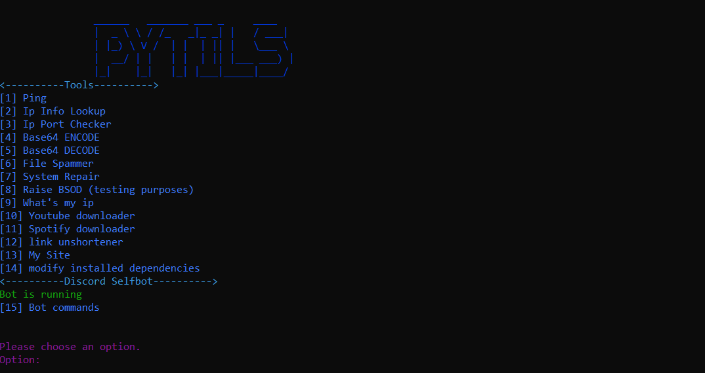
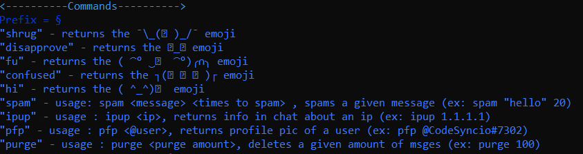

# PyTils

## Table of Contents
+ [About](#about)
+ [Installing](#Installing)
+ [Usage](#usage)
+ [Screenshots](#Screenshots)


## About
PyTils is a python script with tons of usefull functions and a discord selfbot.


### Prerequisites

Python 3 with :

```
-asyncio
-sys
-os
-multiprocessing
-youtube_search
-bs4
-pytube
-webbbrowser
-ctypes
-colorama
-subprocess
-requests
-discord
```


## Installing

Manual installing the script can be done by cloning this repository and making sure you have all modules from the above list. don't worry about needed folders or files, these will be automatically generated

```
git clone https://github.com/CodeSyncio/PyTils.git
cd PyTils
python3 pytils.py
```


**u can also download the prepacked version from the releases, these are click and run**


## Usage

All tools have a number next to them, enter the number, and press enter. you will then see the corresponding tool working.

For the **discord selfbot** u need to put ur tokin in the **config.json** like this:
```
{"discordtoken": "Token Here"}
```
after that, restart the program and you should see "bot running". u can see bot commands in the ***[15] Bot Commands*** option.


## Screenshots
Mainscreen:

Bot commands (currently)

